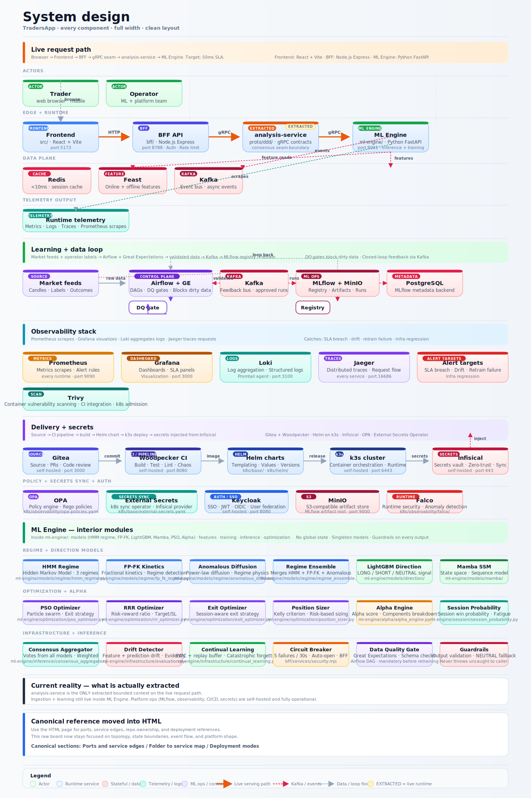
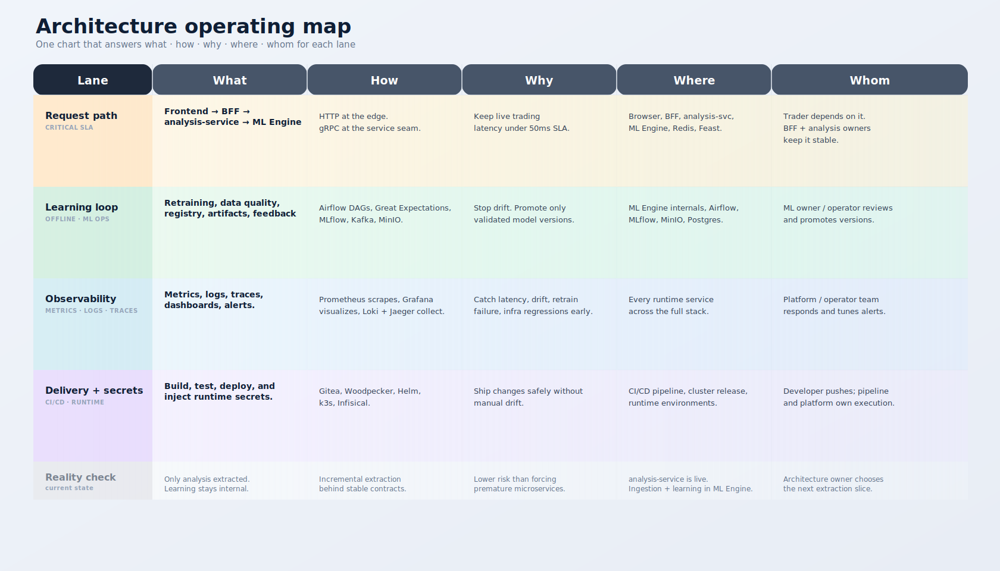
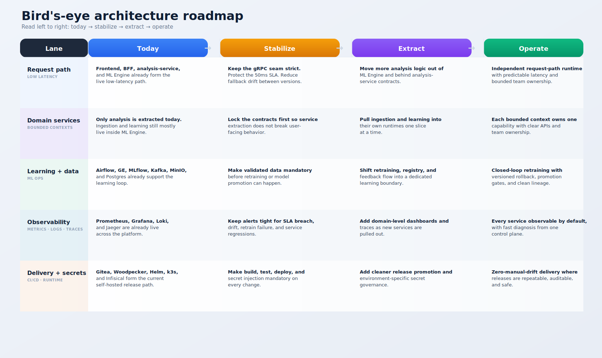

# TradersApp Platform Architecture

Asset variants: [PNG export](./assets/architecture-3d-overview.png) | [Print-friendly SVG](./assets/architecture-3d-overview-print.svg)

TradersApp is now a self-hosted trading ML platform with explicit DDD boundaries, a live gRPC extraction seam, closed-loop retraining controls, and full platform observability. The request path is low-latency and synchronous; the learning, quality, and deployment loops are isolated and automated.

## System design board

Asset variants: [PNG export](./assets/architecture-system-design-board.png) | [Print-friendly SVG](./assets/architecture-system-design-board-print.svg)

This is the detailed service-and-data-flow board, in the same category as a classic system-design map. It shows who enters the system, how requests move through the runtime, where events and state live, and how observability plus delivery control the platform.

## Operating map

Asset variants: [PNG export](./assets/architecture-5w1h-map.png) | [Print-friendly SVG](./assets/architecture-5w1h-map-print.svg)

This chart answers `what`, `how`, `why`, `where`, and `whom` for the live architecture lanes: request path, learning and data, observability, delivery, and the current extraction reality.

## Bird's-eye roadmap

Asset variants: [PNG export](./assets/architecture-birdview-roadmap.png) | [Print-friendly SVG](./assets/architecture-birdview-roadmap-print.svg)

This chart is the roadmap view of the same platform. Read it left to right as `today -> stabilize -> extract -> operate` so you can see how the current architecture evolves without pretending that already-internal domains are fully extracted yet.

## Current system shape

- User traffic enters through the React frontend and terminates at the Node.js BFF.
- The BFF calls `analysis-service` over gRPC for the consensus path, with controlled fallback behavior.
- `analysis-service` is the first extracted bounded-context runtime and currently proxies into the Python ML Engine while the domain is being pulled out safely.
- The ML Engine still owns the deepest model logic, training loop, drift detection, feedback pipeline, and several not-yet-extracted contexts.
- Redis and Feast back the low-latency feature path, Kafka carries event streams, and MLflow owns experiment and registry history.
- Airflow enforces data-quality and monitoring DAGs, while Prometheus, Grafana, Loki, and Jaeger provide live operational visibility.
- Gitea, Woodpecker, Helm, and k3s provide the self-hosted delivery path, with runtime secrets expected to come from Infisical.

## Runtime layers

| Layer | Components | What it does now |
|---|---|---|
| Experience | Frontend (`React`, `Vite`) | Trading UI, dashboards, operator workflows |
| Edge and orchestration | BFF (`Node.js`) | Auth, session control, anti-corruption layer, API composition |
| Domain service | `analysis-service` (`gRPC`) | Stable consensus service contract and extraction seam |
| Core ML runtime | ML Engine (`Python`) | Inference, training, drift detection, feedback, monitoring endpoints |
| Low-latency data plane | Redis, Feast | Online feature serving and cache-backed reads |
| Event plane | Kafka | Market data, model signals, feedback topics |
| MLOps plane | MLflow, MinIO, PostgreSQL | Experiment tracking, registry, artifacts, model lineage |
| Control plane | Airflow, Great Expectations | Data validation, scheduled monitoring, retraining orchestration |
| Observability plane | Prometheus, Grafana, Loki, Jaeger | Metrics, dashboards, logs, traces, alerts |
| Delivery plane | Gitea, Woodpecker, Helm, k3s, Infisical | Build, test, sign, deploy, and inject secrets |

## Bounded contexts and extraction status

| Context | Service boundary | Status | Notes |
|---|---|---|---|
| BFF orchestration | `bff` | Live | Owns frontend-facing contracts and translation logic |
| Analysis | `analysis-service` | Live extraction seam | gRPC is implemented and deployed; internals still proxy ML Engine `/predict` |
| Ingestion | `ingestion-service` contract | Logical only | Ownership is defined in `architecture/ddd/bounded-contexts.json`, but runtime remains inside `ml-engine` packages |
| Learning | `learning-service` contract | Logical only | Retraining, drift, and DQ loops are live, but still run inside the ML Engine process and Airflow DAGs |
| Platform ops | infra stack | Live | Observability, CI/CD, secrets, and Helm rollout are already wired |

## Critical paths and control loops

### 1. Request path

1. Browser hits the frontend.
2. Frontend sends requests to the BFF.
3. BFF calls `analysis-service` over gRPC.
4. `analysis-service` resolves consensus through the ML Engine.
5. Feature lookups come from Redis and Feast where available.

This is the path that carries the low-latency SLA and needs to stay under the 50ms target for critical operations.

### 2. Learning loop

1. ML Engine logs training and registry activity to MLflow.
2. MinIO stores model artifacts; PostgreSQL stores run and registry metadata.
3. Airflow runs model monitoring and retraining DAGs.
4. Great Expectations gates dirty data before retraining is allowed.
5. Approved versions remain in MLflow for rollback and promotion control.

### 3. Observability loop

1. Prometheus scrapes `/metrics` from runtime services.
2. Grafana visualizes latency, drift, resource, and SLA dashboards.
3. Loki centralizes logs; Jaeger collects traces.
4. Alert rules cover 50ms SLA breaches, retrain failures, stale monitoring, and infra regressions.

### 4. Delivery loop

1. Gitea hosts the source of truth.
2. Woodpecker runs unit, integration, performance, chaos, and k8s verification.
3. Images are built, scanned, signed, and deployed through Helm to k3s.
4. Secrets should be injected from Infisical instead of being hardcoded into manifests.

## Deployment modes

| Mode | Entry point | Use case |
|---|---|---|
| Full local stack | `docker-compose.yml` | End-to-end local bring-up with frontend, BFF, ML Engine, MLflow, Kafka, and observability |
| MLOps-only local stack | `docker-compose.mlflow.yml` | Dedicated MLflow + MinIO + PostgreSQL workflow and registry testing |
| Airflow control plane | `docker-compose.airflow.yml` | Data-quality, monitoring, and retraining DAG validation |
| Cluster deploy | `k8s/helm/tradersapp` | k3s production-style rollout with Helm |

## Canonical docs

- [DDD Microservices + gRPC](./DDD_MICROSERVICES.md)
- [MLflow MLOps lifecycle](./MLOPS_MLFLOW.md)
- [Continuous model monitoring + auto-retraining](./MODEL_MONITORING_RETRAINING.md)
- [Data Quality + Airflow](./DATA_QUALITY_AIRFLOW.md)
- [Automated testing + chaos](./AUTOMATED_TESTING.md)
- [Low-latency inference serving](./INFERENCE_SERVING.md)
- [CI/CD with Gitea + Woodpecker](./CICD_GITEA_WOODPECKER.md)
- [Deployment guide](./DEPLOYMENT.md)
- [Setup guide](./SETUP.md)

## Architectural truth to keep in mind

- The repo is no longer a simple three-box app.
- The first real DDD runtime extraction is complete around `analysis-service`.
- Ingestion and learning are defined as bounded contexts, but they are not fully deployed as separate services yet.
- That is intentional. The current architecture prioritizes stable contracts and safe extraction over premature service sprawl.

## License

Proprietary - FXGUNIT
