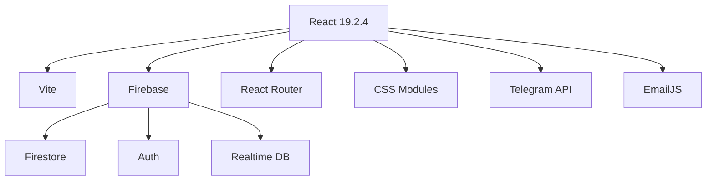
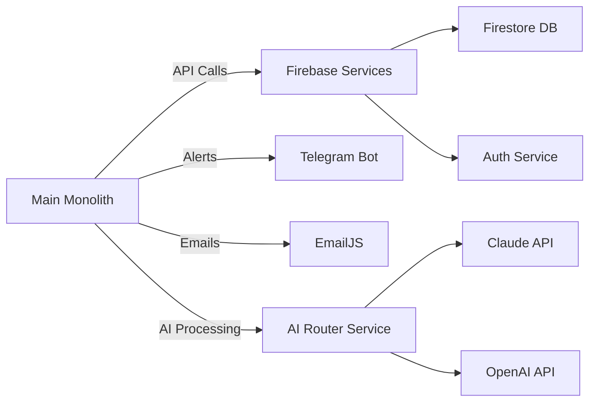

# TradersApp Architecture Overview

## Monolith Structure

Our React-based monolith (`src/App.jsx`) consists of:

1. **Core Infrastructure (Lines 1-500)**
   - Firebase initialization and optimization
   - Session management utilities
   - Security systems (AntiSpamShield, AntivirusGateway)
   - Forensic data collection

2. **UI Utilities (Lines 500-900)**
   - Theme system (AURA Theme Engine)
   - Form validation
   - Clipboard utilities
   - Timezone/date handlers

3. **Complex UI Components (Lines 1100-2200)**
   - CommandPalette
   - NotificationCenter
   - AdminDashboard
   - MainTerminal (trading interface)
   - ThemeSwitcher

4. **Auth System (Lines 3500-4500)**
   - LoginScreen
   - SignupScreen
   - OTPScreen
   - ForcePasswordResetScreen

5. **Admin Systems (Lines 5200-8100)**
   - User management
   - Session monitoring
   - Security alerts
   - Activity logging

## Dependencies

## Microservices Architecture

## Microservices Details:

1. **Firebase Services**
   - Authentication
   - Firestore (NoSQL database)
   - Realtime Database
   - Cloud Functions (serverless backend)

2. **Telegram Bot Service**
   - Real-time security alerts
   - Admin notifications
   - System status updates

3. **EmailJS Service**
   - Transactional emails
   - OTP delivery
   - Password reset flows

4. **AI Router Service**
   - Routes requests to Claude/OpenAI
   - Manages API rate limiting
   - Handles fallback between models
