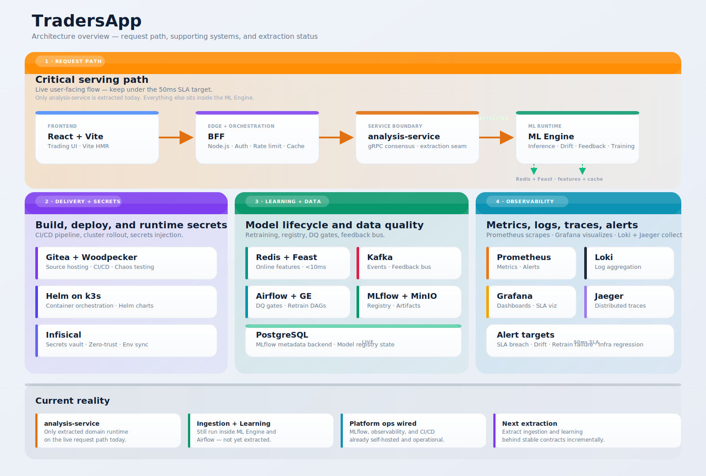

# DDD Microservices Architecture



Asset variants: [Legacy PNG export](./assets/architecture-3d-overview.png) | [Print-friendly SVG](./assets/architecture-3d-overview-print.svg)

This repo is no longer using DDD only as a naming convention. It now has explicit bounded-context ownership, versioned gRPC contracts, and one live extracted service seam on the critical path.

The important nuance is this: the platform is in an incremental extraction phase, not a finished microservice split. That is the correct shape for the current codebase. Stable contracts are already in place, but only the analysis boundary is deployed as its own runtime today.

## What is extracted today vs. what is still internal

| Context | Runtime status | Owns capability | Current implementation state |
|---|---|---|---|
| BFF orchestration | Separate runtime | Frontend orchestration, auth boundary, translation layer | Live and stable |
| Analysis | Separate runtime seam | Low-latency consensus and scoring API | `analysis-service` is live over gRPC, but still proxies ML Engine HTTP `/predict` internals |
| Ingestion | Logical bounded context | Market data ingestion and persistence | Contracts and ownership exist; runtime remains in `ml-engine/data` and `ml-engine/kafka` |
| Learning | Logical bounded context | Retraining, drift control, DQ gate | Contracts and ownership exist; runtime remains in `ml-engine/training`, `ml-engine/feedback`, and Airflow DAGs |

Source-of-truth manifest: `architecture/ddd/bounded-contexts.json`

## Why this split is defensible

- The low-latency request path needed a stable seam first, so analysis was extracted before the rest.
- Ingestion and learning are higher blast-radius domains because they touch persistence, orchestration, and long-running jobs.
- Keeping those two contexts logically bounded before physically extracting them avoids premature service sprawl and keeps the migration reversible.

## Versioned service contracts

Contracts live in `proto/ddd/v1/`:

- `common.proto`
- `analysis.proto`
- `ingestion.proto`
- `learning.proto`

These contracts are the boundary, not the internal package layout. Internal Python and Node implementations can change as long as the service contracts stay compatible.

## Live analysis boundary

`analysis-service` is the active extraction seam on the consensus path.

Runtime details:

- gRPC port: `50051`
- health port: `8082`
- entrypoint: `bff/analysis-server.mjs`

Current behavior:

1. The BFF sends consensus requests to `AnalysisService.GetConsensus`.
2. `analysis-service` validates and normalizes the request contract.
3. The service proxies the call into the existing ML Engine HTTP `/predict` path.
4. The response comes back through the stable gRPC contract.

This keeps the frontend and BFF stable while analysis logic is moved out of the monolith in controlled slices.

## Transport and fallback policy

`bff/services/consensusEngine.mjs` uses `bff/services/analysisTransport.mjs` to choose the transport.

Environment variables:

- `ML_ANALYSIS_TRANSPORT=http|grpc`
- `ML_ANALYSIS_GRPC_ADDR`
- `ML_ANALYSIS_GRPC_STRICT=true|false`

Current intended operating mode:

- `grpc` in compose and Helm
- `grpcStrict=false` during extraction and soak testing

Behavior:

- `http`: BFF calls ML Engine `/predict` directly.
- `grpc`: BFF calls `analysis-service`.
- If gRPC fails and strict mode is `false`, the BFF falls back to HTTP.
- When the analysis service is fully hardened, strict mode can be turned on to remove fallback.

## Boundary rules that matter now

The boundary verifier is intentionally small and CI-safe:

```bash
node scripts/architecture/verify-ddd-boundaries.mjs
```

It enforces:

- manifest-owned paths exist
- `bff/domains` does not import from `bff/services` or `bff/routes`
- `bff/services` does not import from `bff/routes`

That is not full architecture linting, but it is enough to stop the most common boundary regressions while the repo is still moving.

## How DDD connects to the rest of the platform

- MLflow, MinIO, and PostgreSQL give the learning context a stable control plane even before the service is physically extracted.
- Airflow DAGs already act as the operational shell around the learning context.
- Prometheus, Grafana, Loki, and Jaeger provide cross-service visibility without coupling domain logic together.
- GitHub Actions currently drives the documented public-cloud deployment path, while Gitea and Woodpecker exist in-repo as the self-hosted CI/CD path.
- Helm + k3s remain the production-style self-hosted rollout path, but the delivery story should currently be described as mixed rather than purely self-hosted.

## Practical migration order

1. Keep the BFF on gRPC with fallback enabled.
2. Move analysis logic from the ML Engine into `analysis-service` behind the existing proto contract.
3. Extract ingestion around Kafka and feature materialization once ownership is clean.
4. Extract learning only after retraining and DQ orchestration are stable enough to move without breaking operational controls.
5. Turn on strict gRPC enforcement after the analysis path has enough soak time.
